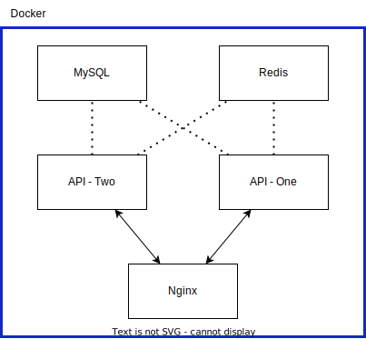

# __Nome do Projeto__
URL Shortner

## **_Conteúdos Abordados_**
* [Descrição](#descrição)
* [Requisitos Funcionais](#requisitos-funcionais)
* [Requisitos Não Funcionais](#requisitos-não-funcionais)
* [Arquitetura do Sistema](#arquitetura-do-sistema)
* [Tecnologias Utilizadas](#tecnologias-utilizadas)
* [Instalação e Execução](#instalação-e-execução)
* [Contato](#contato)

## __Descrição__
Este projeto é um encurtador de URLs que permite aos usuários criar URLs curtas para links longos. O objetivo do projeto é simplificar a forma como os usuários compartilham e acessam informações na web. O projeto foi desenvolvido como parte da disciplina de _Desenvolvimento Avançado de Sistemas_.

## __Requisitos Funcionais__
* Os usuários devem ser capazes de inserir um link longo e obter uma URL curta gerada automaticamente.
* Os usuários devem ser capazes de personalizar a URL curta.
* Os usuários devem ser capazes de visualizar todas as URLs curtas criadas.
* Os usuários devem ser capazes de editar ou excluir as URLs curtas criadas.

## __Requisitos Não Funcionais__
* O sistema deve ser seguro, garantindo que somente usuários autorizados possam criar e editar URLs curtas.
* O sistema deve ser escalável, permitindo que um grande número de URLs curtas possam ser criadas e armazenadas.
* O sistema deve ser rápido, garantindo que as URLs curtas sejam geradas e redirecionadas rapidamente.
* O sistema deve ser confiável, garantindo que as URLs curtas geradas estejam sempre disponíveis e funcionando corretamente.

## __Arquitetura do Sistema__
O sistema será construído usando a arquitetura servidor, com o servidor sendo responsável pelo processamento e armazenamento de URLs curtas. A seguir, são descritos os componentes do sistema:

* __Servidor__: responsável por gerar e armazenar URLs curtas. O servidor deve fornecer uma API para permitir que o cliente crie, edite e exclua URLs curtas.
* __Banco de Dados__: responsável por armazenar as URLs curtas e os dados associados, como o link longo, a URL curta personalizada e a data de criação.
* __Load Balancer__: responsável por redistribuir as cargas de trabalhos entre os containers.

## __Tecnologias Utilizadas__
* Backend: Node.js, Express, MySQL, Nginx, Redis

## __Instalação e Execução__
Para instalar e executar o sistema, siga os seguintes passos:

1. Clone o repositório do projeto.
2. Crie o arquivo `.env` conforme o `.env.example`
3. Instale as dependências do projeto usando `npm install`.
4. Inicie o servidor usando `docker-compose up`.
5. Use a API do sistema em http://localhost:3001.

## __Contato__
Pedro Cardozo - `p-cardozo@hotmail.com` ou `609455@univem.edu.br`